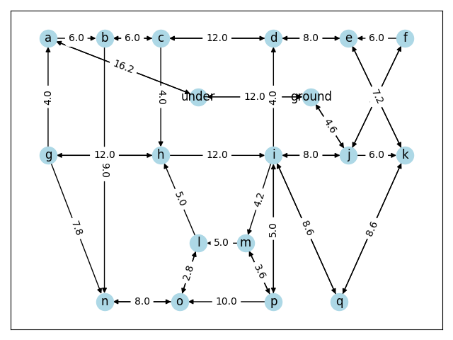

# asciidigraphs
WIP: Python library for parsing ASCII directed graphs.

## Missing
* rationale/why use it
* API documentation
* meaningful parsing errors instead of AssertionError, KeyError, ValueError, etc.

## Example
The following code snippet shows how to parse an ASCII directed graph, then convert it to
a `networkx.DiGraph` and finally display it by means of `matplotlib`.

```python
import networkx as nx
from matplotlib import pyplot

from asciidigraphs.networkx_support import to_networkx
from asciidigraphs.parser import parse

if __name__ == "__main__":
    graph = parse(
        r"""
    (A)--->(B)-----(C)------(D)-----(E)<--(F)
     ^      |       |        ^         \ /
     |      |       |        |          X
     |      |       v        |         / \
    (G)-----+------(H)----->(I)-----(J)-->(K)
     |      |         \    / |       |     |
     |      |          (LL)  |       |     |
     |      v         /    \ |       |     |
    (M)----(N)-----(O)<-----(P)-----(Q)<--(R)

(teleport)
""",
        "(R)->(teleport)->(A)",
    )
    nx_graph = to_networkx(graph)
    pos_by_node_symbol = {node.symbol: (node.pos.x, -node.pos.y) for node in graph.nodes}
    nx.draw_networkx(nx_graph, pos=pos_by_node_symbol)
    nx.draw_networkx_edge_labels(
        nx_graph,
        pos=pos_by_node_symbol,
        edge_labels={
            (e.from_node.symbol, e.to_node.symbol): len(e.symbol) for e in graph.edges
        },
    )
    pyplot.show()
```

Expected output:


